# ☀️ Awesome Solar Asset Management 🚀

  
  
  
  
  
  

---

## 📌 Overview

Welcome to the definitive, SEO-optimized curated directory of **Solar Asset Management (SAM)**, **Photovoltaic (PV) Monitoring**, **Asset Performance Management (APM)**, **O&M Workflow Automation**, **Aerial Thermal Inspection AI**, and **Open-Source Solar Software stacks**.

This repository serves solar asset owners, EPCs, O&M engineers, portfolio managers, and energy technologists looking for commercial SaaS platform pricing, market evaluation metrics, and open-source self-hosted PV dashboards.

---

## 📑 Table of Contents

- [📌 Overview](#-overview)
- [📈 Market Analysis & Industry Structure](#-market-analysis--industry-structure)
- [🏢 Commercial SaaS Platforms](#-commercial-saas-platforms)
- [💻 Open-Source GitHub Projects](#-open-source-github-projects)
- [🛠️ Additional PV Developer Resources](#️-additional-pv-developer-resources)
- [🤝 How to Contribute](#-how-to-contribute)
- [⚠️ Disclaimer](#️-disclaimer)
- [📈 Star History](#-star-history)

---

## 📈 Market Analysis & Industry Structure

> 🌐 **Estimated Market Size**: The global **Solar Asset Management & Solar Software Market** is estimated at **$1.85 Billion USD** in 2026, projected to reach **$4.8 Billion USD by 2032** growing at a Compound Annual Growth Rate (CAGR) of **17.2%**.
> 
> 🧩 **Industry Structure**: The sector is **moderately to highly fragmented**, characterized by ongoing strategic M&A consolidation (such as Aurora Solar acquiring HelioScope, Power Factors acquiring Greenbyte & Inaccess/Unity, Stem acquiring AlsoEnergy/PowerTrack, and Enverus acquiring RatedPower). While enterprise SCADA and design CAD tools have established category leaders, the ecosystem remains non-concentrated—leaving substantial market share for specialized aerial thermography, field O&M, and open-source local monitoring stacks.

---

## 🏢 Commercial SaaS Platforms

Below is the curated comparative matrix of commercial solar software platforms, sorted by **Company Size (Revenue / Valuation)** in descending order.

| 🏢 Platform | 🔍 Key Focus / Description | 💰 Company Size (Revenue / Valuation) | 🏷️ Starting Tier Pricing | 🆓 Free Tier / Trial Limit |
| :--- | :--- | :--- | :--- | :--- |
| **[Aurora Solar](https://www.aurorasolar.com/)** | Residential & C&I solar design, 3D shading analysis, financial modeling, and sales proposals. | **~$4.0B Valuation** (~$100M+ ARR) | Starts at $159/user/month (Foundation plan) | No free tier or trial; live product demo available on request |
| **[AlsoEnergy / PowerTrack](https://www.alsoenergy.com/)** | Commercial & utility solar asset monitoring, multi-vendor data aggregation, and O&M analytics. | **~$695M Valuation** (~$400M+ Stem Parent Rev) | Starts at $500/site/year (hardware logger bundle tier) | No free tier or trial; guided live demo on request |
| **[Power Factors](https://www.powerfactors.com/)** | Enterprise asset performance management platform (Drive / former Greenbyte) for multi-GW solar & wind fleets. | **~$500M Valuation** (~$100M+ ARR) | Starts at $30/user/month (basic user tier entry) | No free tier or trial; personalized sales demo on request |
| **[DroneDeploy Solar](https://www.dronedeploy.com/)** | Drone mapping, thermal inspection, and 360-degree construction progress tracking platform. | **~$500M Valuation** (~$50M+ ARR) | Starts at $329/month (or $4,188/year for Individual plan) | 14-day free trial with full drone mapping and 360 ground capture (no credit card required) |
| **[PVcase](https://pvcase.com/)** | Utility-scale and commercial PV design automation plugin for AutoCAD / Civil 3D. | **~$300M Valuation** (~$25M+ ARR) | Starts at $10,000/year (plus ~$2,000/year AutoCAD license requirement) | 14-day free trial (requires active AutoCAD installation and demo approval) |
| **[Raptor Maps](https://raptormaps.com/)** | AI-powered aerial inspection and solar asset analytics platform turning thermal imagery into module insights. | **~$150M Valuation** (~$15M+ ARR) | Starts at $300/map (inspection mission starting rate) | No free tier or trial; live interactive demo on request |
| **[RatedPower](https://ratedpower.com/)** | Cloud software for utility-scale solar plant engineering and automated layout optimization. | **~$100M Valuation** (~$10M+ ARR) | Starts at $15,000/year (Basic enterprise plan with unlimited projects) | No free trial or free tier; 1-on-1 sales demo available on request |
| **[Solar-Log](https://www.solar-log.com/)** | Residential to commercial PV monitoring platform with multi-inverter logging & smart energy control. | **~$30M - $40M Annual Rev** (BKW AG Subsidiary) | Starts at €20/year (WEB Enerest M package) | Free forever tier for systems up to 3 kWp; 30-day free trial for premium packages |
| **[Scanifly](https://scanifly.com/)** | Drone-based 3D photogrammetry and site assessment tool for PV shading analysis and layout design. | **~$30M Valuation** (~$5M - $10M ARR) | Starts at $150/user/month (base subscription tier) | No free trial or free tier; 1-project paid demo flight available |
| **[Solargis](https://solargis.com/)** | Solar resource data, irradiance, satellite climate data, and bankable PV yield simulation services. | **~$20M - $30M Annual Rev** | Starts at €4,800/year (Solargis Prospect base subscription) | Free forever tier for 1 MWp system simulation & free global solar maps; no trial for full suite |
| **[HelioScope](https://www.helioscope.com/)** | Web-based PV layout design, shading, and bankable energy yield modeling software (Acquired by Aurora). | **~$15M - $20M ARR** (Part of Aurora Solar) | Starts at $159/license/month (Basic plan, up to 10 projects/month & 1.25 MW DC capacity) | 30-day free trial (up to 5 projects with full feature access) |
| **[Unity Monitoring](https://powerfactors.com/solutions/unity/)** | SCADA, power plant controller (PPC), and real-time monitoring suite for utility-scale PV assets. | **~$15M+ Rev Unit** (Part of Power Factors) | Starts at $15,000/site/year (utility SCADA and monitoring package) | No free tier or trial; live SCADA environment demo available on request |
| **[Deck Monitoring](https://www.deck.co/)** | Solar PV data acquisition hardware and monitoring software for C&I installations. | **~$5M - $10M Annual Rev** | Starts at $500/site (includes hardware logger + 5-year monitoring license package) | No free tier or trial; hardware installation demonstration on request |
| **[HelioVolta / SolarGrade](https://solargrade.io/)** | Fieldwork, inspection, and O&M work-order management software for solar PV assets. | **~$3M - $5M ARR** | Starts at $39/user/month (Pro plan) | 14-day free trial with full mobile app and workflow access |
| **[SolarNexus](https://www.solarnexus.com/)** | Solar CRM, project management, and sales quoting workflow software for installers and developers. | **~$2M - $5M ARR** (Acquired by Solo) | Starts at $49/user/month (Solo base platform tier) | 14-day free trial available upon request |

---

## 💻 Open-Source GitHub Projects

Below is the list of top open-source solar monitoring, PV performance simulation, microinverter DTU loggers, and energy management projects, sorted by **GitHub Star Count** in descending order.

- **[evcc](https://github.com/evcc-io/evcc)**   
  ⚡ Extensible EV charge controller with native PV solar energy integration, grid feed-in optimization, dynamic electricity pricing, and multi-inverter support.

- **[OpenDTU](https://github.com/tbnobody/OpenDTU)**   
  📡 Open-source Data Transfer Unit for Hoymiles and TSUN solar microinverters via NRF24L01+/CMT2300A chips, exposing real-time web UI, MQTT, and Home Assistant metrics.

- **[pvlib-python](https://github.com/pvlib/pvlib-python)**   
  🐍 Widely used Python library for simulating photovoltaic system performance, modeling solar irradiance, clear-sky models, and module temperature dynamics.

- **[MyEMS](https://github.com/MyEMS/myems)**   
  📊 Industry-grade open-source Energy Management System (EMS) for PV production, battery energy storage systems (BESS), microgrids, and building carbon accounting.

- **[Pecos](https://github.com/sandialabs/pecos)**   
  🔬 Sandia National Laboratories' Python quality-control package for time-series performance data, automated anomaly detection, and solar PV sensor validation.

- **[Solectrus](https://github.com/solectrus/solectrus)**   
  ☀️ Self-hosted photovoltaic dashboard for monitoring solar generation, battery status, heat pumps, EV charging, grid feed-in, and financial metrics.

- **[Sunalyzer](https://github.com/BorisBrock/Sunalyzer)**   
  🔌 Vendor-independent, local-first solar monitoring solution with Docker self-hosting, SQLite/InfluxDB storage, and responsive web frontend.

- **[MeterMan](https://github.com/aamcrae/MeterMan)**   
  ⚡ Modular data collection daemon for solar PV inverters and utility meters, uploading telemetry directly to PVOutput, MQTT, and Home Assistant.

- **[Solarmon](https://github.com/Elwell/solarmon)**   
  ⚙️ Modbus-RTU / TCP inverter polling toolkit and metrics collector for Solis, Growatt, and Sungrow PV inverters.

- **[Solar-PV-Monitoring](https://github.com/lewei50/Solar-PV-Monitoring)**   
  🏠 Home Assistant + InfluxDB + Grafana reference stack for multi-string solar PV monitoring, yield forecasting, and battery management.

---

## 🛠️ Additional PV Developer Resources

- **pvlib-python**: Standard open-source library for PV performance modeling and solar irradiance calculations.
- **Modbus / Inverter Gateways**: RS485 and Modbus-TCP libraries for reading data from SMA, Fronius, SolarEdge, Huawei, and Sungrow inverters.
- **Time-Series Analytics Stack**: InfluxDB, TimescaleDB, Grafana, and Prometheus tailored for sub-second solar telemetry.
- **Aerial Inspection Processing**: Drone thermal imaging pipelines for solar module degradation and hot-spot detection.

---

## 🤝 How to Contribute

1. 🍴 Fork the repository.
2. 📝 Add or edit entries in `README.md` following the standard table and star-badge format.
3. 🔗 Include official product links, factual descriptions, pricing tiers, and open-source star badges.
4. 🚀 Submit a Pull Request (PR) with a clear explanation of additions.

---

## ⚠️ Disclaimer

- This directory is **community-curated** for research and educational purposes.
- Solar asset management systems impact grid stability, financial yields, and equipment safety guarantees. Always verify commercial terms and data security standards directly with vendors.

---

## 📈 Star History

---

**Made with ❤️ for solar asset managers, O&M teams, EPCs, performance engineers, and clean energy technologists.**
